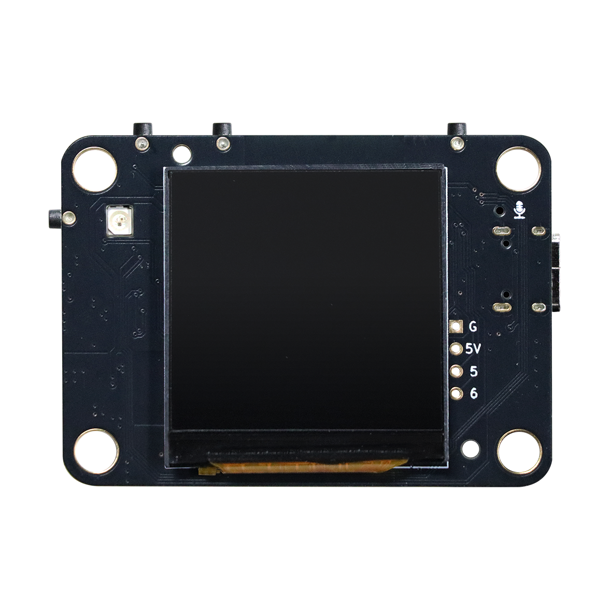
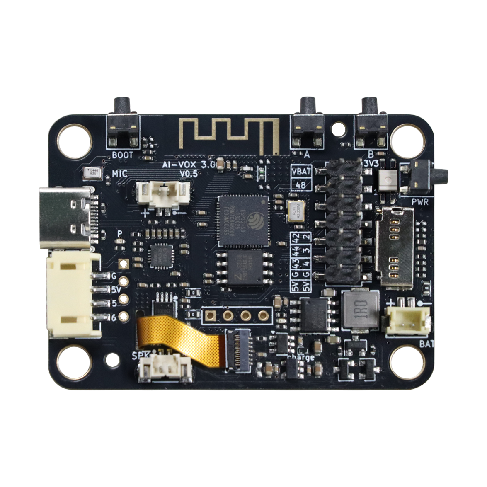
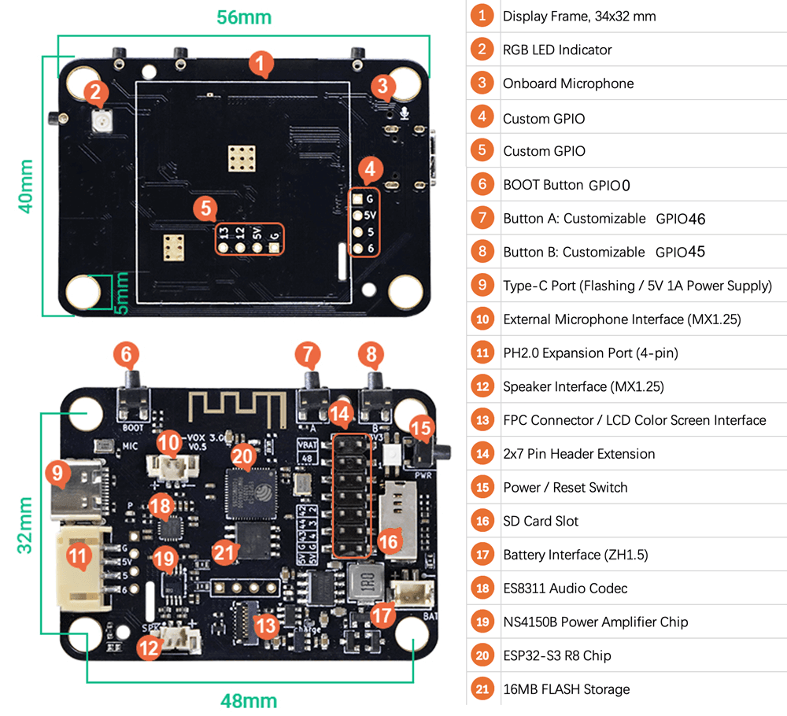
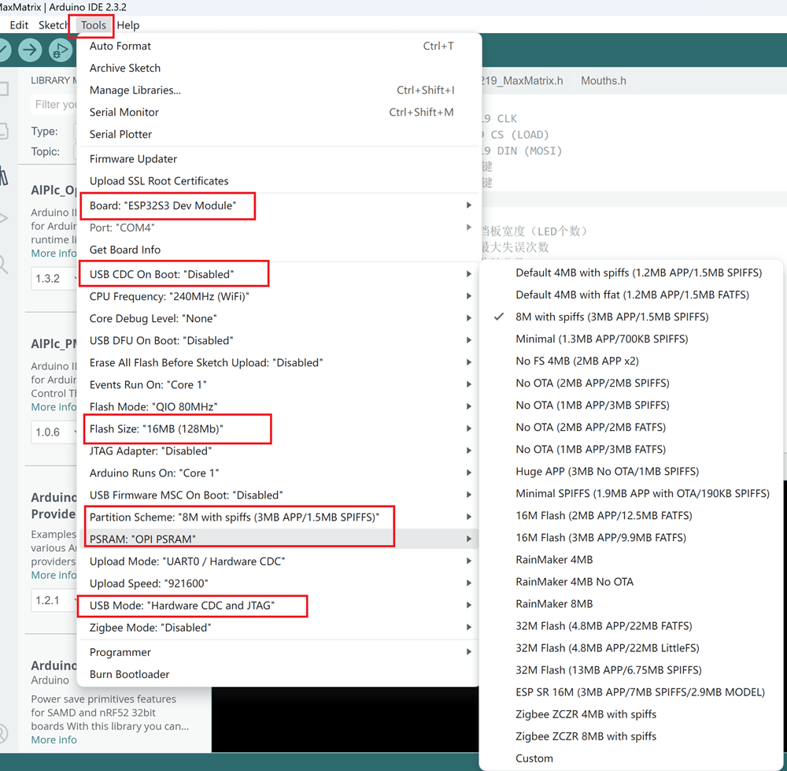

# AI-VOX3

## Intrduction

AI-VOX3 is a high-performance embedded development board designed specifically for AI voice interaction applications. It is built around the **ESP32-S3-R8** chip and integrates **16MB Flash** memory on-board. The board integrates a microphone, power amplifier speaker, SD card slot, power management circuit, and other hardware resources, supporting rapid development and flexible expansion. It supports **local voice wake-up**, **command recognition**, and **text-to-speech (TTS)** synthesis, making it widely applicable in smart home, educational equipment, and IoT terminal scenarios.

| Front                            | Back                            |
|:--------------------------------:|:-------------------------------:|
|  |  |

## Function Labeling Diagram

## **Development Board Features**

* Equipped with the **ESP32-S3R8** high-performance Xtensa 32-bit LX7 dual-core processor, with a main frequency up to 240MHz.

* Supports **2.4 GHz Wi-Fi (802.11 b/g/n)** and **Bluetooth 5 (LE)** with an onboard antenna.

* The ESP32-S3R8 chip integrates **512 KB SRAM**, **384 KB ROM**, and **8MB PSRAM**, along with an onboard **16 MB Flash** storage chip.

* Utilizes a **Type-C** interface supporting program download, onboard power supply, and lithium battery charging. It is compatible with mainstream development environments, simplifying development and power management processes.

* Integrates the **Power and Reset buttons into one**. System reset and power on/off are combined into the Power button: short press to power on or reset the system, long press to power off, simplifying operation.

* Supports connection to a **1.54-inch 240×240 resolution SPI interface LCD (ST7789)**, providing an intuitive graphical user interface.

* Features reserved **LCD ribbon cable** and **OLED sockets**, allowing the user to choose between OLED or LCD color screen display.

* Onboard **ES8311 audio codec** and **3W audio amplifier (NS4150B)** supporting high-fidelity audio input/output, requiring an external speaker connection.

* **Dual microphone design**: Includes an onboard analog microphone and a reserved **MX1.25 external analog microphone interface**, supporting single-microphone interruption.

* Onboard **SD Card interface** supporting large-capacity storage expansion.

* Onboard **BOOT button(IO0)**, **2 user buttons (A--->IO46/B--->IO45)**, and a **WS2812B RGB LED (IO41)**, facilitating interactive debugging and status indication.

* Provides a set of **8 GPIO pin headers (IO43/44/42/48/4/3/2/1)**, supporting connection to various peripherals.

* Reserved **4-pin PH2.0 interface(IO5/IO6)** which can be used for convenient power supply via PH2.0 or for communication with other main controllers.

* Onboard **charging and boost 5V 1.2A output integrated circuit** supporting external lithium battery power supply and real-time battery level detection via **IO18 ADC**.

## **Charging Instructions**

* USB Type-C interface: 5V, **Current** maximum 1.2A;

* Charging and boost conversion efficiency: 95%;

* Yellow-green LED (CHG) blinking indicates charging is in progress. Steady on indicates the battery is fully charged.

## **Power Supply Instructions**

* Power can be supplied via the Type-C interface (5V);

* Power can be supplied via a ZH1.5 lithium battery (3.7~4.2V);

* Power can be supplied via the PH2.0-4pin interface (5V);

* Regardless of the power supply method used, a **short press** of the **PWR button** is required to power on the device.

## **PWR Button and LED Indicator Instructions**

* **Short press** the PWR button to power on; the red **P LED** will light up. **Long press** the PWR button to power off; the red **P LED** will turn off.

* After powering on (via a short press of the PWR button), a **second short press** of the PWR button will **reset** the main control board.

## **Schematic Diagram**

[Click to view the AI-VOX3 schematic diagram](./AI-VOX3_V1.1.pdf)

## Arduino Test Demo

[Welcome to ESP32 Arduino Core’s documentation - - — Arduino ESP32 latest documentation](https://docs.espressif.com/projects/arduino-esp32/en/latest/index.html)

**select dev board:**

